  

   

  <h1>Hi there, I'm Saketh P 👋</h1>
  
<strong>devfusioncode</strong>

  

    <strong>Final-Year Computer Science Student</strong> · <strong>Backend Engineer</strong> · <strong>UI/UX Enthusiast</strong>
  

  

    <em>Building robust backend services with Django &amp; FastAPI, grounded in hardware and networking fundamentals, and crafted with an eye for clean interfaces.</em>
  

---

## 👨‍💻 About Me

Final-year Computer Science & Engineering student focused on backend development, databases, and computer systems, with a genuine interest in UI/UX design.

- 🎓 **Academics:** Final-year B.Tech in Computer Science and Engineering.
- ⚙️ **Backend:** Building RESTful APIs and database-driven services with **Python, Django, and FastAPI**.
- 🛠️ **Hardware & Networking:** Practical experience with basic PC assembly, hardware troubleshooting, and networking fundamentals.
- 🎨 **UI/UX & Figma:** Designing clean, intuitive layouts and wireframes in Figma before bringing them to code.
- 💡 **Mindset:** I prefer building things as I learn them rather than waiting until I "know enough" to start.

---

## 🛠️ Technical Stack & Tooling

A breakdown of the languages, frameworks, developer tools, and hardware skills I work with:

| Domain | Core Technologies & Tools |
| :--- | :--- |
| **Languages** | `Python` &nbsp; `Java` &nbsp; `C` &nbsp; `SQL` |
| **Backend & Databases** | `Django` &nbsp; `FastAPI` &nbsp; `Django REST Framework` &nbsp; `REST APIs` &nbsp; `PostgreSQL` &nbsp; `MySQL` &nbsp; `SQLite` |
| **Frontend & Design** | `HTML5` &nbsp; `CSS3` &nbsp; `JavaScript` &nbsp; `Figma` &nbsp; `UI/UX Prototyping` &nbsp; `Design Systems` |
| **Hardware & Networking** | `PC Assembly (Basics)` &nbsp; `Hardware Troubleshooting & Repair` &nbsp; `Computer Networking Fundamentals` &nbsp; `Linux (CLI)` |
| **Developer Tools** | `Git` &nbsp; `GitHub` &nbsp; `VS Code` &nbsp; `Postman` |
| **Foundations & Theory** | `Data Structures & Algorithms` &nbsp; `Computer Networks` &nbsp; `Cybersecurity & Forensics (Exploring)` &nbsp; `Database Management Systems (DBMS)` |

---

## 🎯 Current Focus

Here is what I am actively exploring and deepening right now:

- 🛡️ **Cybersecurity & Forensics:** Learning network security fundamentals, forensic analysis concepts, and secure coding practices.
- ⚙️ **Backend & APIs:** Building clean, well-structured REST APIs with **Django** and **FastAPI**.
- ⚡ **Databases:** Improving database schema design and writing efficient queries.
- 🎨 **Figma to Code:** Translating UI designs from Figma into clean, responsive HTML and CSS.

---

## 💡 Beyond the Screen

A few things I enjoy outside of daily coursework:

- 🛠️ **Hardware & Networking:** Basic PC assembly, troubleshooting hardware issues, and understanding physical components.
- 📸 **Photography:** Capturing visual details and composition, which also helps when designing clean interfaces.
- 🎵 **Music:** Keeps me focused while coding and studying.
- 🧩 **Problem Solving:** Practicing coding problems on LeetCode and working through logic puzzles.

---

## 📬 Let's Connect

I'm always open to discussing backend engineering, full-stack development opportunities, hardware setups, UI/UX collaborations, or interesting software challenges:

| Platform | Link |
| :--- | :--- |
| **LinkedIn** | [https://www.linkedin.com/in/sakethp-](https://www.linkedin.com/in/sakethp-) |
| **Portfolio** | [https://dev-fusion-code.github.io/portfolio/](https://dev-fusion-code.github.io/portfolio/) |
| **LeetCode** | [https://leetcode.com/u/devfusion/](https://leetcode.com/u/devfusion/) |

